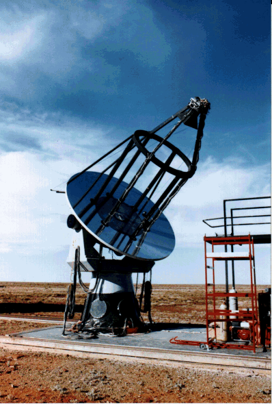

# CANGAROO I

photo by S.Kamei

http://icrhp9.icrr.u-tokyo.ac.jp/

A rare monolithic mirror IACT.

### References

~~~
@article{roberts1998tev,
  title={TeV gamma-ray observations of Southern BL Lacs with the CANGAROO 3.8 m Imaging Telescope},
  author={Roberts, MD and Dazeley, SA and Edwards, PG and Hara, T and Hayami, Y and Holder, J and Kakimoto, F and Kamei, S and Kawachi, A and Kifune, T and others},
  journal={arXiv preprint astro-ph/9811260},
  year={1998}
}

~~~
Section 2: '''The reflector is a single 3.8 m diameter parabolic dish with f/1.0 optics.'''
