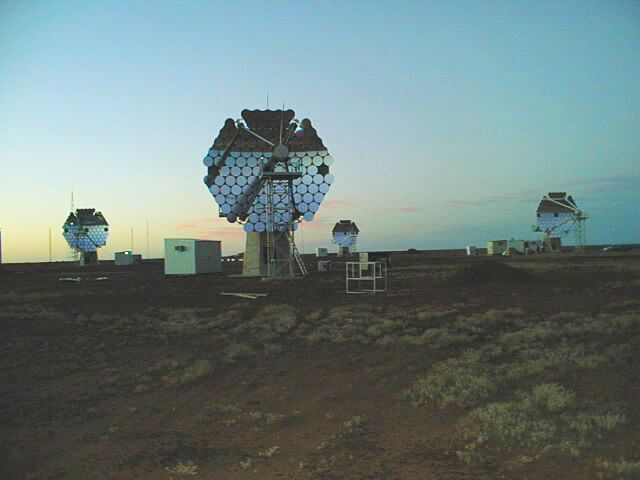

# CANGAROO III

http://icrhp9.icrr.u-tokyo.ac.jp/c-iii.html

### References
~~~
@article{kubo2004status,
  title={Status of the CANGAROO-III project},
  author={Kubo, Hidetoshi and Asahara, A and Bicknell, GV and Clay, Roger W and Doi, Y and Edwards, PG and Enomoto, R and Gunji, S and Hara, S and Hara, T and others},
  journal={New Astronomy Reviews},
  volume={48},
  number={5},
  pages={323--329},
  year={2004},
  publisher={Elsevier}
}
~~~
Layput: Figure 1), mirror facets in Section 2, disc shape, 80cm diameter