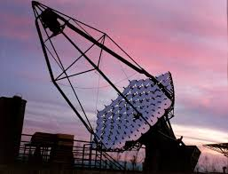

# CAT France

Cherenkov Array at Themis

Unknown photographer.

### References
~~~
@article{barrau1998cat,
  title={The CAT imaging telescope for very-high-energy gamma-ray astronomy},
  author={Barrau, A and Bazer-Bachi, R and Beyer, E and Cabot, H and Cerutti, M and Chounet, LM and Debiais, G and Degrange, B and Delchini, H and Denance, JP and others},
  journal={Nuclear Instruments and Methods in Physics Research Section A: Accelerators, Spectrometers, Detectors and Associated Equipment},
  volume={416},
  number={2},
  pages={278--292},
  year={1998},
  publisher={Elsevier}
}
~~~
Layout Figure 4., disc shaped mirror facet diameter is 50cm.