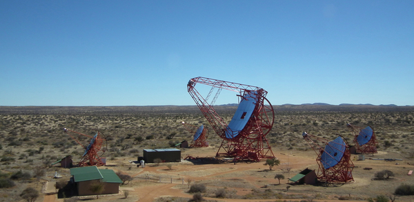

# H.E.S.S. II

High Energy Stereoscopic System II

Image taken from [HESS web pages](https://www.mpi-hd.mpg.de/hfm/HESS/pages/about/telescopes/) (2017 July 21). The large middle telescope is HESS II.

### References
~~~
@inproceedings{cornils2005optical,
  title={The optical system of the HESS II telescope},
  author={Cornils, R and Bernl{\"o}hr, Konrad and Heinzelmann, G{\"o}tz and Hofmann, Werner and Panter, Michael},
  booktitle={International Cosmic Ray Conference},
  volume={5},
  pages={171},
  year={2005}
}
~~~
Layout, Figure 1, Right; Mirror facets in Figure 1 caption, hexagonal 90cm flat to flat. 