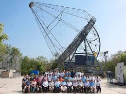
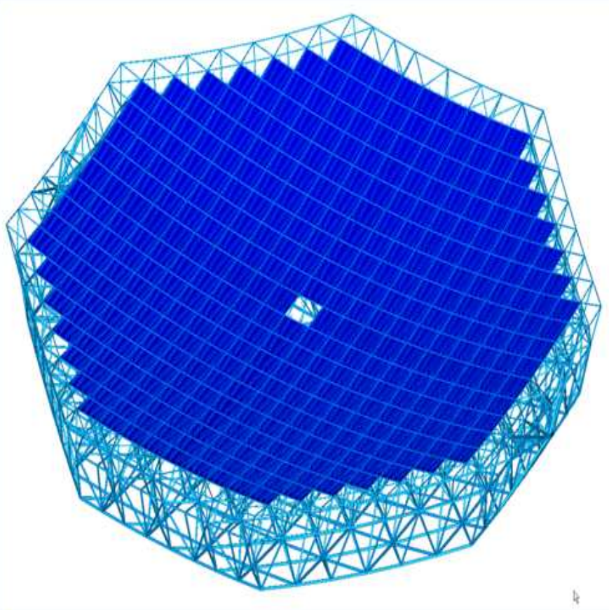

# MACE

Major Atmospheric Cherenkov Experiment

A mono IACT.

### Aperture
| imaging reflector | |
| :---         |          ---: |
| focal length |           25m |
| official diameter |     21m |
| mirror area    |    337m^2 |

### FoV
| image sensor | |
| :---         |          ---: |
| pixels |           1088 |
| pixel inner diameter FoV |     0.125° |
| pixel FoV area |     0.01353°^2 |
| FoV eff. diameter | 4.33° |
| FoV area  | 14.72°^2 |

### References

~~~
@online{
    yadav2013mace,
    author = {Kuldeep, Yadav},
    title = {Status of the MACE telescope},
    year = 2013,
    url = {http://moriond.in2p3.fr/J13/transparencies/yadav.pdf}
    urldate = {2017-07-24}
}
~~~

- 352 mirror panels (4 mirror facets on each panel)
- facet size 50cm x 50cm

