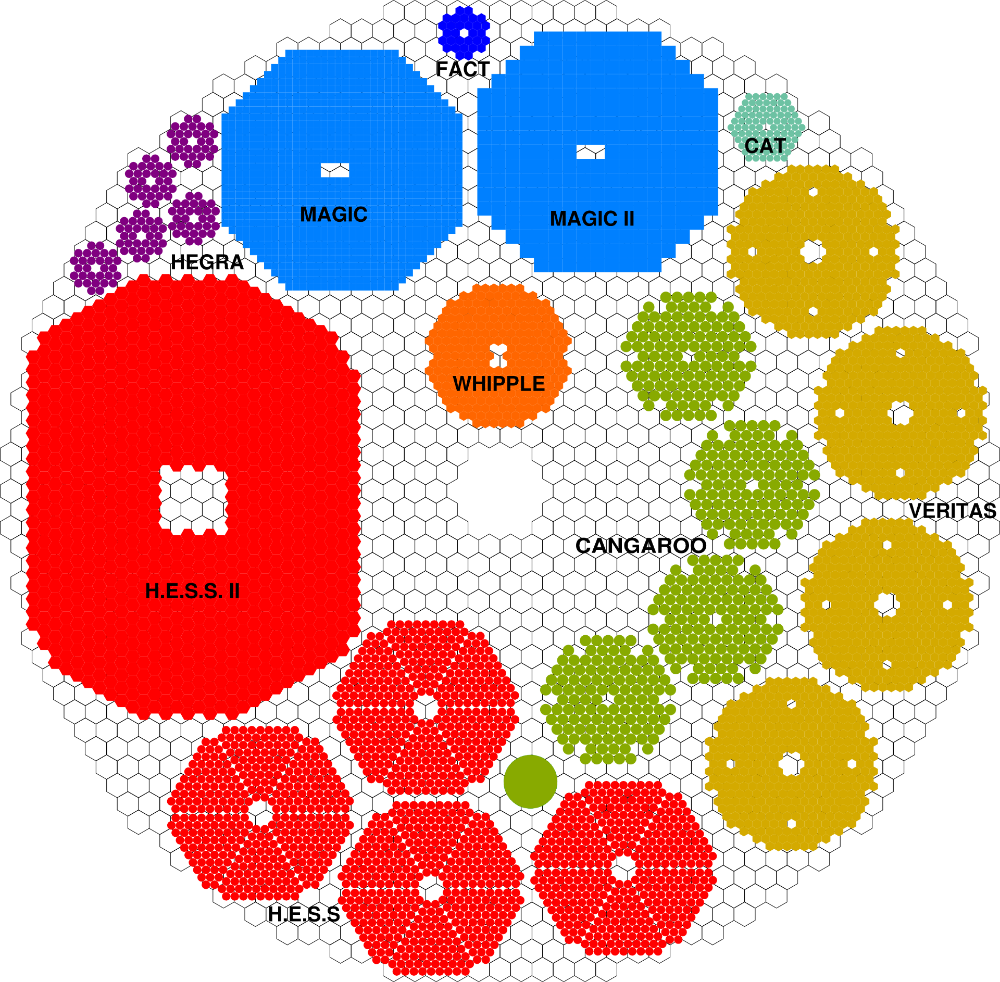

# Apertures in Cherenkov-Astronomy

[](https://opensource.org/licenses/MIT)

Inspired by wikipedia-user ```Cmglee``` and his illustrative work on the [aperture sizes comparisn of telescopes in optical astronomy](https://commons.wikimedia.org/wiki/File:Comparison_optical_telescope_primary_mirrors.svg).


## Example


Create figures comparing former, current, or future instruments in Cherenkov-astronomy. Feel free to use, and modify for your work. If you find mistakes, please create a pull request.

### Please cite

~~~
@misc{mueller2016aperture,
    author = {Mueller, Sebastian Achim},
    title = {Apertures in Atmospheric Cherenkov Astronomy},
    howpublished = {https://github.com/cherenkov-plenoscope/aperture_history},
    year = {2016}
}
~~~
  
