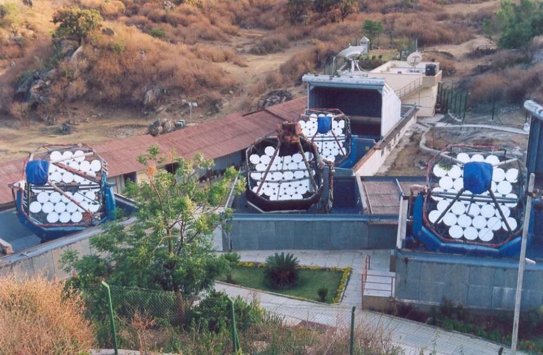

# TACTIC

image from reference below.

An array of 4 IACTs.

### References
~~~
@article{acharya2005ground,
  title={Ground Based $\gamma$-ray Astronomy in India},
  author={Acharya, BS},
  journal={Past, Present and Future. Proc. 29th ICRC, Pune},
  year={2005}
}
~~~

There is only the overall mirror area of 9.5m^2 for each telescope, so given the 32 facets, I conclude each facet is 61.5cm in diameter.