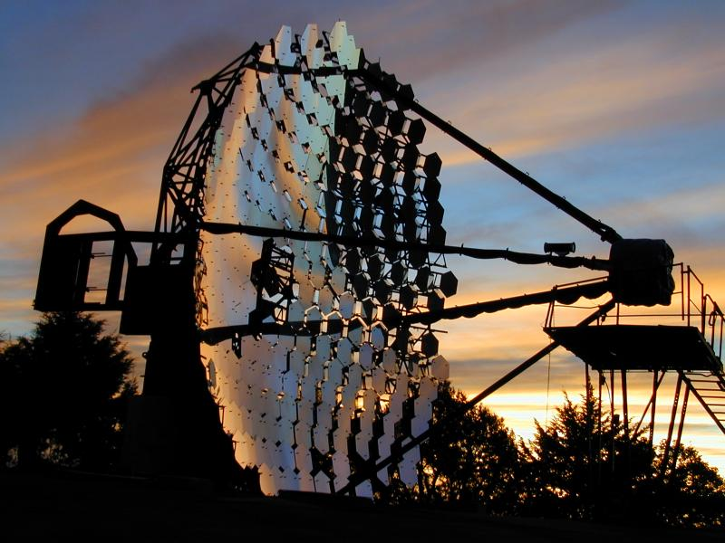

# WHIPPLE

Image taken from [VERITAS/WHIPPLE homepage](https://veritas.sao.arizona.edu/whipple-10m-topmenu-117)

The cradle of Imaging Atmospheric Cherenkov Telescopes.
Thank you Travor, Hillas and collaborators.

### References
~~~
@article{lewis1990optical,
  title={Optical characteristics of the Whipple Observatory TeV gamma-ray imaging telescope},
  author={Lewis, DA},
  journal={Experimental Astronomy},
  volume={1},
  number={4},
  pages={213--226},
  year={1990},
  publisher={Springer}
}
~~~
Page 216:
'''The individual mirrors are hexagons, 61cm across,...''' 